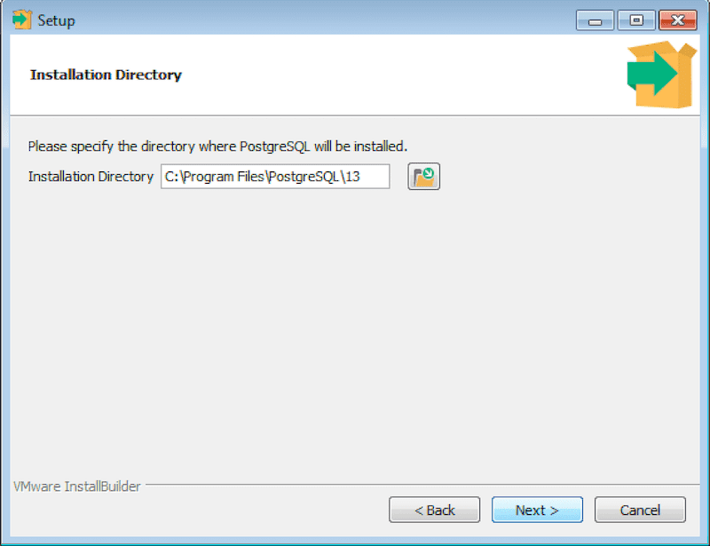
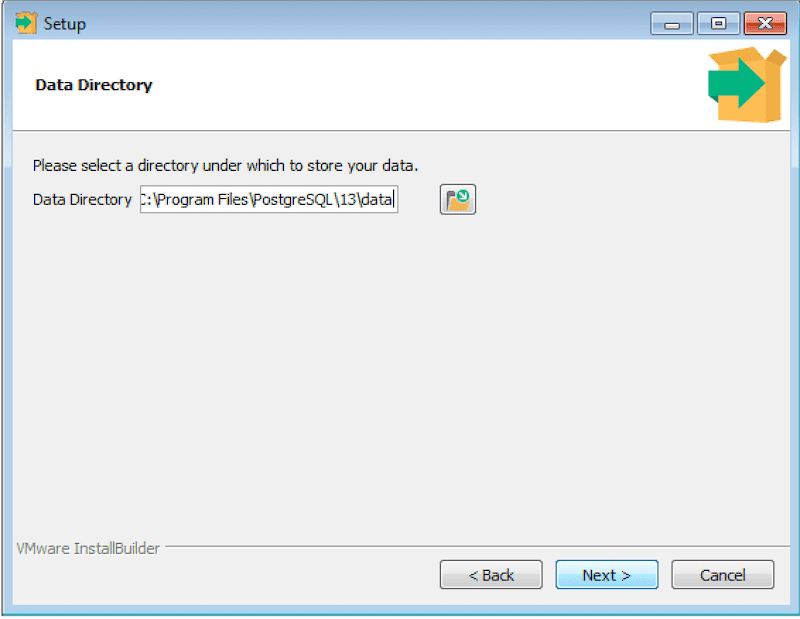
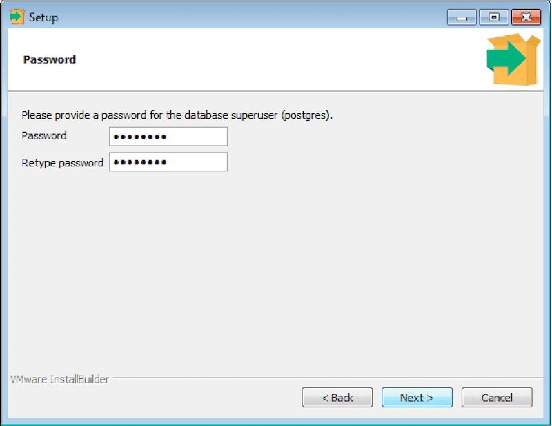
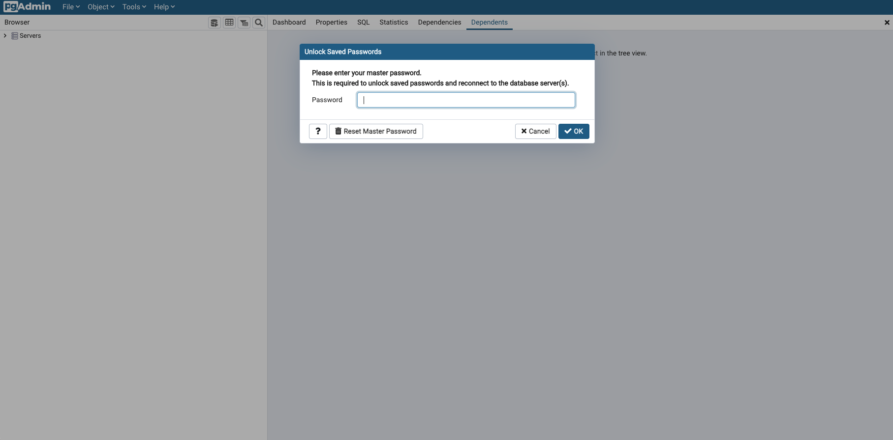
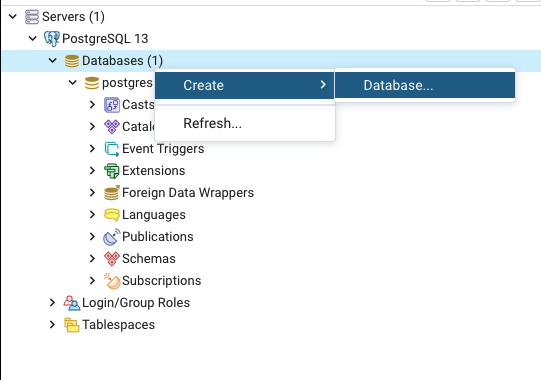
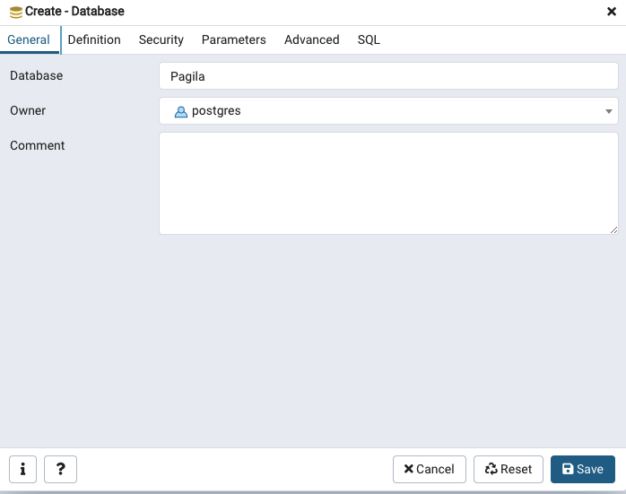
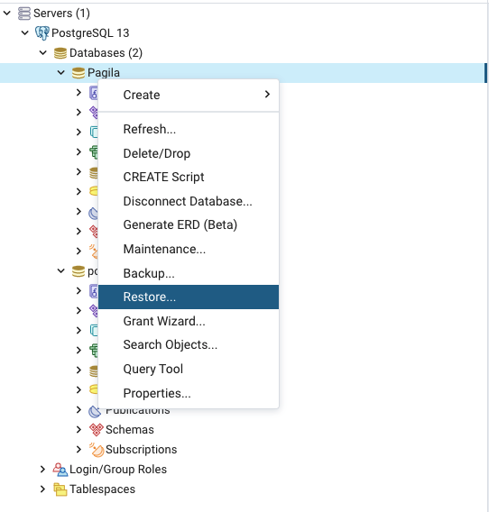
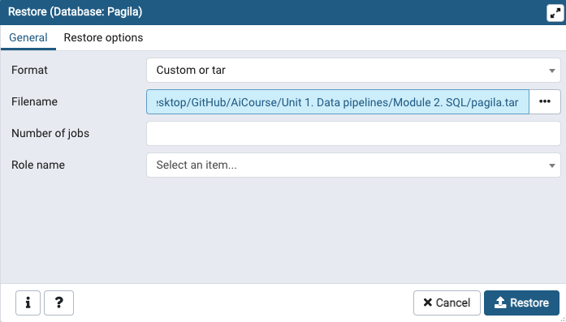
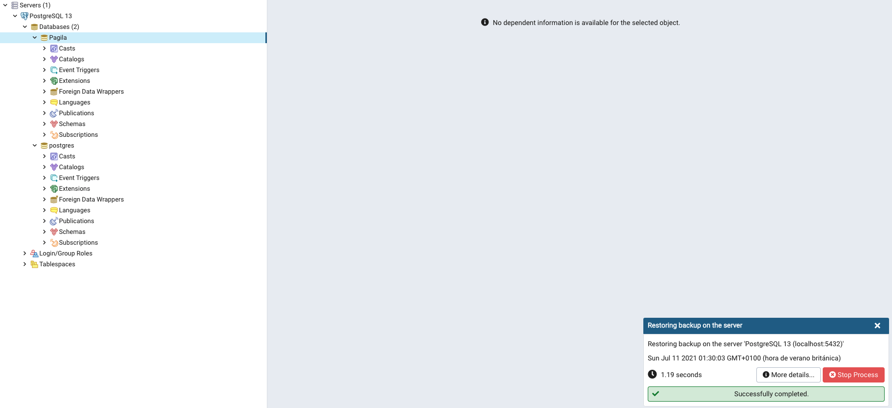
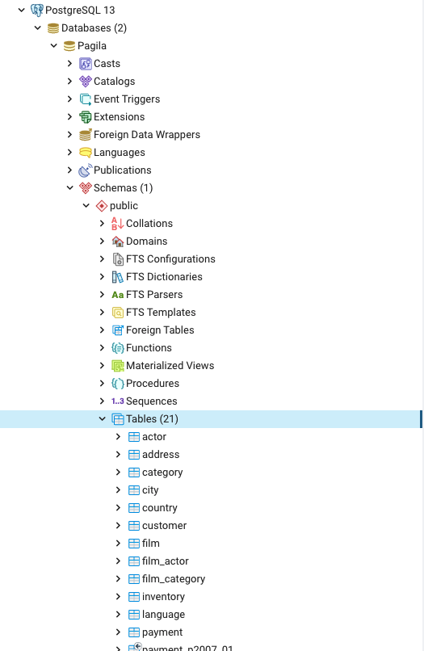

# Setting up PostgreSQL

This document will guide you through the PostgreSQL set up, tool that we will use for making queries. This guide specifies the steps for installing PostgreSQL and pgAdmin4, a management tool for PostgreSQL.

## Download PostgreSQL

We will rely on the EnterpriseDB installer that provides:

- A PostgreSQL installer
- pgAdmin 4, the open-source PostgreSQL administration tool
- The Stack Builder package manager

To download it, go to https://www.enterprisedb.com/downloads/postgres-postgresql-downloads, and select the version according to your OS. Select the latest version (by the time this is written, it is version 13.3). If you are using Linux, refer to the following page: https://www.postgresql.org/download/linux/ and https://www.pgadmin.org/download/pgadmin-4-apt/ which will help you configure PostgreSQL and pgAdmin4.

Open the downloaded file, and follow the steps. The following images are taken from a Windows system, but the setup wizard in Mac is almost identical.

1. The PostgreSQL setup wizard opens. Click Next to continue.

2. Accept the default installation directory and click Next to continue.

3. Select the components you want to install. We might not need the Stack Builder component, but installing it won't hurt, so tick every box and click Next

4. Accept the default location in which you wish to store the data files.

5. Choose a password for the superuser. PostgreSQL uses the password specified for both the database superuser and the PostgreSQL service account. On note on this: PostgreSQL runs as a service in the background; the PostgreSQL service account is named postgres. If you have already created a service account with the name postgres, you must specify same password as the existing password for the postgres service account.
Use a password that you will remember, if you have no experience with PostgreSQL, changing the password is tough.

6. Use the default port number on which the server should listen (5432) and click Next

7. Use the default locale and click Next

8. Keep clicking Next until the 'Installing' window appears. This will take a few minutes

9. Uncheck the Stack Builder box, we don't need it now, and click Finish

For some reason the last window was in Spanish...

Now, you will be able to open pgAdmin 4, which will make our life easier for managing PostgreSQL.

## Import the Pagila database to pgAdmin 4

If you are on Mac, you will find pgAdmin under the PostgreSQL folder in Applications (or open Spotlight (Cmd + space) and type pgadmin). 

If you are on Windows, you can find it in searching pgadmin in the start menu search bar.

Once you open it, you will be prompted with the following window:

Enter the password you introduced in step 5. Click Servers, and a new window might pop up. Introduce your password again.

Now create a database by first clicking on PostgreSQL 13, and then right-clicking on Databases. Then click create, and then click Database...

Name the database Pagila (you can give it any name) and click save.

The pagila database is still empty. Let's populate it by right-clicking on the name of the database, and then clicking on Restore...

In the next window, the format should be custom or tar, and in filename, search and select the pagila.tar included in this repo

Ignore the error that might prompt

Give it a few seconds, and check that the database has been imported. Click Schemas > Public > Tables

You should see something like the following image:

Great job! You are ready to start mastering SQL now!
